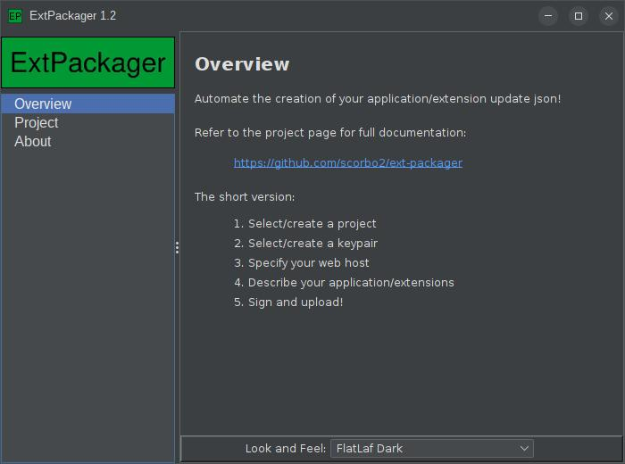

# ExtPackager



## Comprehensive documentation

Refer to the [swing-extras-book](https://www.corbett.ca/swing-extras-book/app-extensions/ExtPackager.html)
for a full guide to the extension mechanism in swing-extras, and how to use ExtPackager.
Brief documentation is provided below.

## What is this?

Given the following:

- You have used [swing-extras](https://github.com/scorbo2/swing-extras/) to create a Java application
- You're using the AppExtension mechanism in swing-extras to allow for dynamically-loaded extensions
- You want to use the UpdateManager in swing-extras to allow for dynamic extension discovery and download

Then you can use `ExtPackager` to digitally sign your extension jars, and generate the application update
json that will allow your application to discover your extensions, download them, and install them.

## Where do I get it?

An installer tarball is available for Linux-based systems:
- [http://www.corbett.ca/apps/ExtPackager-1.2.tar.gz](http://www.corbett.ca/apps/ExtPackager-1.2.tar.gz)
- Size: 10MB
- SHA-1: `efa545c37aba1955ab25d4ab95ddbe722c9d34b6`

Alternatively, you can clone the source code from GitHub and build it yourself:
- GitHub repo: [https://github.com/scorbo2/ext-packager](https://github.com/scorbo2/ext-packager)

To clone and build, you'll need Maven 3.x and Java 17 installed. Then run:
```
git clone https://github.com/scorbo2/ext-packager.git
cd ext-packager
mvn package
java -jar target/ext-packager-1.2.jar
```

## How does it work?

There are two json files that need to be generated:

- the update sources json that you ship with your application. This one is very small, and basically just answers the question of "where do I look for extensions?"
- the version manifest json that you host somewhere. This one is comprehensive, and answers the question "what extensions are available for which versions of my application?"
The `ExtPackager` application can generate both of these for you, which saves a lot of hand-editing of json.

## Optional - Package signing

Signing your extension jars is optional, but highly recommended. Your application can use the `SignatureUtil` facility
in swing-extras to verify that the extension jar that is downloaded is valid. The following requirements must be
met to use package signing:

- You have generated a public/private key pair
- You have made the public key available on your web host
- Your extension jars are signed with your private key

The `ExtPackager` application can handle all of this for you (including key pair generation).

## How do I use it?

Fire up the application and walk through the UI:

- Create and name a new project in ExtPackager
- Generate a key pair (optional)
- Import and sign your extension jar(s) (signing is optional, but recommended)
- ExtPackager will generate the sources json (to be bundled with your application)
- ExtPackager will generate the version manifest json (to be hosted on your web server)
- You can attach optional screenshots to your extension versions
- Upload the manifest and signed jars to your web host
- Distribute your application with the sources json included
- Create an UpdateManager instance in your application, pointing it to the sources json
- Give this UpdateManager instance to the ExtensionManagerDialog in your application
- That's it! Your application will be able to discover, download, install, and upgrade your extensions dynamically.

## Can I add new extensions or versions after the application is released?

Yes! That's the whole point! :) By re-running `ExtPackager` with your new extension(s), or new
extension version(s), you can generate new manifest json to be uploaded to your web host, and your
already-distributed application can detect the new extension(s) or new version(s) and present them
for download/upgrade. Your already-distributed application does not need to be re-released or modified,
because the extension discovery and download is all dynamic.

## What if I release a new application version?

Your already-installed and now out-of-date application will be able to detect that it is no longer 
the latest version, and can notify the user that an upgrade is available. This is currently
visible on the AboutPanel for your application, if you supply it with an UpdateManager instance,
so that it can perform the application version check.

Future versions may include the ability for applications to auto-download and install application
upgrades, but this is not currently implemented.

## License

ExtPackager is made available under the MIT license: https://opensource.org/license/mit

## Revision history

[Full release notes and version history](src/main/resources/ca/corbett/extpackager/ReleaseNotes.txt)
